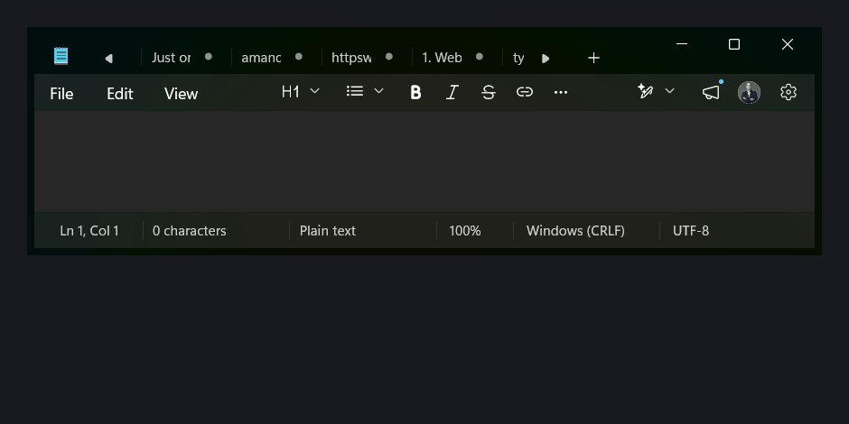

# Prose

**Speak freely. Get prose.**

System-wide AI dictation for Windows — hold a hotkey, speak, and cleaned-up text is typed into whatever app is focused.

**Pipeline:** hotkey → mic capture → [Groq Whisper](https://console.groq.com) transcription → AI cleanup (fillers removed, punctuation fixed) → pasted into the active window.

<p align="center">
  
</p>

<p align="center"><em>Spoken: “um, so like, I was thinking we should uh send them the report tomorrow, you know, before the meeting.”<br>Pasted: “So I was thinking we should send them the report tomorrow, before the meeting.”</em></p>

> An independent personal project. Not affiliated with, endorsed by, or derived from the code of [Wispr Flow](https://wisprflow.ai), whose product inspired the idea.

## Download

**Option 1 — winget** *(pending [submission](packaging/winget))*

```powershell
winget install DanielRadicheski.Prose
```

**Option 2 — direct download**

Download the `.zip` from the [latest release](../../releases/latest), **extract it**, and run `Prose.exe` inside the folder. No installer, no Python needed. On first launch it asks for a free [Groq API key](https://console.groq.com/keys) — that's the only setup.

*(It's a folder, not a single `.exe`, on purpose: a one-file build unpacks itself into a temp folder on every launch, which antivirus can interrupt mid-unpack and stop it from starting. The folder build has nothing to race.)*

> ### ⚠️ Windows will warn you. That's expected.
>
> You'll see **"Windows protected your PC"**. Click **More info → Run anyway**.
>
> This happens because Prose isn't **code-signed** — a signing certificate costs a few hundred dollars a year and Prose is free. It is *not* evidence the app is safe or unsafe, only that I haven't paid Microsoft's toll.
>
> **Don't take my word for it — [verify it](#verify-your-download) instead.**

---

## Is Prose safe? Read this bit.

I'd rather you be suspicious, so let me be blunt about what Prose does. To work at all, it must:

| It does this | Which honestly looks like |
|---|---|
| Hook your keyboard globally, to catch the hotkey | a **keylogger** |
| Record your microphone | an **audio bug** |
| Read and write your clipboard, to paste text | **credential theft** |
| Upload your audio to a server | **exfiltration** |

That is genuinely the behaviour profile of spyware. **You should not trust a random unsigned .exe that does those things** — from me or anyone else. So here's how to check rather than trust:

### What it actually does, in the code

Every one of those capabilities is a few lines you can read yourself:

- **Keyboard hook** — [main.py](main.py) (`_start_hotkey_listener`). It only ever checks *whether your hotkey is held*. Keystrokes are never stored, logged, or transmitted.
- **Microphone** — [audio.py](audio.py). The mic stream opens **only** while the hotkey is held, and closes the moment you release it. Nothing is recorded when you're not dictating.
- **Clipboard** — [inject.py](inject.py). It saves your clipboard, pastes the transcript, and puts your clipboard back.
- **Network** — [transcribe.py](transcribe.py) and [cleanup.py](cleanup.py). These are the **only** two files that make any network request. There is no telemetry, no analytics, no update check, and no server of mine anywhere.

### What leaves your machine

| Data | Where it goes | Why |
|---|---|---|
| The audio you dictate | Groq ([data policy](https://console.groq.com/docs/your-data) — not retained by default) | Speech-to-text |
| The resulting transcript | Groq | Cleaning up "um"s and punctuation |
| **Nothing else. Ever.** | — | — |

Your API key is stored **only** in `%APPDATA%\Prose\.env` on your own PC. It's never sent anywhere except to Groq to authenticate you. **Prose has no backend** — I cannot see your dictation, and I couldn't collect it if I wanted to.

### Verify your download

Releases are built by **GitHub Actions from the public source in this repo** — no binary is ever uploaded from my machine. You can check the exe you downloaded is exactly what this code produces:

```powershell
# 1. Cryptographic proof it was built by CI from this repo's source
gh attestation verify Prose-1.0.1-win64.zip --repo danielRadiceski/prose

# 2. Or compare the checksum against the .sha256 file in the release
Get-FileHash Prose-1.0.1-win64.zip -Algorithm SHA256
```

Or skip the binary entirely and [run from source](#run-from-source) — it's about six short Python files.

### Why does my antivirus complain?

It might, and it's a **false positive**. Prose is packaged with [PyInstaller](https://pyinstaller.org), which bundles a Python interpreter — a pattern real malware droppers also use, so heuristic scanners sometimes flag it. This is a [long-standing, well-known problem](https://github.com/pyinstaller/pyinstaller/issues/5854) that affects nearly every PyInstaller app. (The download is built in folder mode rather than a single self-extracting exe, specifically to avoid the worst of this.)

Combined with the keyboard hook and mic access, Prose ticks a lot of heuristic boxes.

**Here is the current VirusTotal report for the released binary** — including any engines that flag it:

<!-- Paste the VirusTotal permalink for each release here. -->
📊 [VirusTotal scan for v1.0.0](https://www.virustotal.com/gui/file/4991bdf82ef3af683451f6824b35967dba4f19e3a0c2cabbf19ec797308ca8ad)

I'd rather show you the detections than have you find them yourself. If you're still not comfortable, don't add an antivirus exclusion — **[run it from source](#run-from-source) instead**, where there's no binary to trust at all.

---

## Run from source

The safest way to use Prose: nothing to trust but the code in front of you.

1. **Python 3.11+** (tested on 3.14, Windows 11).

2. **Install dependencies:**
   ```
   py -m pip install -r requirements.txt
   ```

3. **API key:** copy `.env.example` to `.env` and add `GROQ_API_KEY` — free at [console.groq.com](https://console.groq.com/keys). That one key covers both transcription and cleanup.

4. **Run:**
   ```
   py main.py
   ```
   A microphone icon appears in the system tray.

## Usage

- Hold **Ctrl+Win** and speak; release to finish. Text appears in the focused app a second or two later.
- A floating pill near the bottom of the screen shows a **live waveform** while you speak, then pulsing dots while transcribing. It never steals focus. Disable with `OVERLAY_ENABLED=false`.
- Right-click the tray icon to pause Prose, toggle **AI Cleanup** (off = raw transcript, lower latency), or quit.
- Tray icon color: 🔵 ready · 🔴 listening · 🟠 processing · ⚪ disabled.

### Toggle mode instead

In `.env`, set `HOTKEY_MODE=toggle` — then **Ctrl+Alt+Space** starts dictating and pressing it again stops.

### Changing the hotkey

`HOLD_KEY` accepts a single key (`f9`) or a combo (`ctrl+win`). Avoid bare `alt` — releasing Alt activates the menu bar in many apps, which swallows the paste.

## Building it yourself

```
py -m pip install pyinstaller
py build.py
```

Produces `dist/Prose/` (the app folder) and `dist/Prose-<version>-win64.zip` (the download), plus a `.sha256`. It's a **folder** build (`--onedir`), not a single exe — it extracts once rather than on every launch, which sidesteps the antivirus race that can otherwise stop a one-file build from starting. All runtime output goes to `%LOCALAPPDATA%\Prose\prose.log`.

> **Note:** No Electron required — the overlay is drawn with Python's built-in `tkinter`. Electron/Tauri would only be worth it for a full HTML settings UI.

## Install and run at startup

```
py build.py      # produces dist/Prose/
py install.py    # copies it somewhere stable + starts it with Windows
```

`install.py` copies the **whole app folder** to `%LOCALAPPDATA%\Programs\Prose\` (so rebuilding `dist/` can't break the startup entry), carries your API key over to `%APPDATA%\Prose\.env`, and registers Prose under the per-user `HKCU\...\Run` key. **No admin rights**, nothing outside your user profile.

To undo:
```
py install.py --uninstall
```

**Toggling startup:** tray menu → **Start with Windows**. It's also listed in *Settings → Apps → Startup* and *Task Manager → Startup apps*, so you can disable it the normal Windows way.

Other options: `py install.py --no-startup` (install only), `py startup.py status|enable|disable` (startup entry only).

## Sharing Prose with someone else

**API keys are never compiled into the app** — it reads them from disk at runtime. So the app folder on its own is safe to hand over.

On a machine with no key, Prose shows a **setup dialog** asking for the recipient's own free Groq key (with a link to get one), then saves it to `%APPDATA%\Prose\.env` — per-user, no admin rights needed.

- ✅ **Send:** the `.zip` from the release. It sets itself up.
- ❌ **Never send:** your `.env`, or any folder containing it. `.env` is **hidden in Windows Explorer**, so it rides along silently in a zip. Whoever has it spends **your** Groq and Anthropic credits, with no per-user limit.

`build.py` never copies your real `.env` into the app folder, and warns you if one is sitting there.

### Where keys are read from

First match wins:

1. `.env` beside `Prose.exe` — portable install
2. `.env` in the project folder — development
3. `%APPDATA%\Prose\.env` — written by the setup dialog

Tray → **Open settings folder** opens (3) so keys can be changed or deleted.

> There is no safe way to embed keys in a desktop app for someone else to use — anyone can unpack a PyInstaller build and read what's inside. If you ever want others to use Prose *on your account*, the keys must live on a server you control, behind auth and rate limits.

If a key ever leaks, revoke it: [Groq console](https://console.groq.com/keys) · [Anthropic console](https://console.anthropic.com/settings/keys)

## Choosing the cleanup model

Transcription always runs on Groq Whisper. The **cleanup** step is pluggable via `CLEANUP_PROVIDER`:

| Provider | Latency\* | Extra key? | Notes |
|---|---|---|---|
| **`groq`** (default) | **~270 ms** | No — reuses `GROQ_API_KEY` | `llama-3.3-70b-versatile`. Groq [does not retain inference data by default](https://console.groq.com/docs/your-data). |
| `anthropic` | ~1100 ms | `ANTHROPIC_API_KEY` | Claude Haiku. Best punctuation; keeps more of your phrasing. |
| `gemini` | untested | `GEMINI_API_KEY` | ⚠️ On Google's **free tier**, prompts and responses [may be used to improve Google products](https://ai.google.dev/gemini-api/docs/billing), with human review in some cases. Your dictation is often personal — prefer the paid tier, or another provider. |

\* Measured on this project's dictation samples; see `CLEANUP_PROVIDER` in [.env.example](.env.example).

**Faithful by design:** cleanup only removes fillers/stutters and fixes punctuation — it keeps your exact words and won't swap them for synonyms. If the model ever rewrites or paraphrases instead of tidying, a guardrail detects the divergence and pastes your raw transcript instead. Cleanup failures never lose your words either — same fallback.

## Configuration

All optional settings (hotkey, models, cleanup default) are documented in [.env.example](.env.example).

## Icons

Two artworks live in [icon.py](icon.py), because one image can't do both jobs:

| | Used for | Why |
|---|---|---|
| **Logo** ([assets/prose_logo.png](assets/prose_logo.png)) | `.ico` sizes 48–256 | The cursive wordmark is illegible below ~48px |
| **Mic glyph** (drawn in code) | Tray icon, `.ico` sizes 16–32 | Stays crisp at 16px, and tints per state |

`build.py` bakes both into a single multi-resolution `prose.ico`, so Windows picks the right artwork for each context. The tray glyph is recolored live: 🔵 ready · 🔴 listening · 🟠 processing · ⚪ disabled.

Preview the glyph states with `py icon.py`.

## Testing individual pieces

Each module runs standalone:

```
py audio.py        # records 3s -> test.wav
py transcribe.py   # transcribes test.wav via Groq
py cleanup.py      # cleans a sample filler-laden sentence via Claude
py inject.py       # pastes a test string into whatever you focus
```

## Known limitations (MVP)

- Text is injected via clipboard paste (Ctrl+V); your previous **text** clipboard is restored afterward, but non-text clipboard contents (images, files) are not preserved.
- In toggle mode, the hotkey's Space keypress may also reach the focused app in some cases.
- Apps that block simulated input (elevated/admin windows, some games) won't receive the paste — run the app as admin if you need dictation there.
- Bluetooth headsets (e.g. Pixel Buds) take ~0.5–1s to start delivering audio after recording begins, so the first word can get clipped — pause briefly after pressing the hotkey, or use a wired/built-in mic.
- Cloud transcription: audio is sent to Groq; cleaned text to Anthropic. No audio is stored locally.
